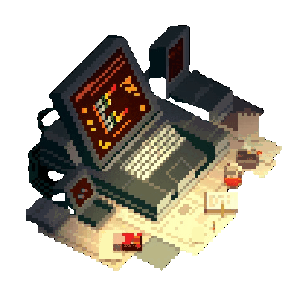

<!-- CABEÇALHO ANIMADO -->

  

  

---

  

<h3 align="center">💻 Ciência da Computação | Desenvolvimento Web | Full-Stack em Construção</h3>

<!-- LINHA ANIMADA -->

  

## 📌 Sobre Mim

<table style="border: none;" border="0" cellpadding="0" cellspacing="0">
  <tr style="border: none; vertical-align: middle;">
    <td style="border: none; width: 60%;">

👋 Meu nome é **Kauã** e atualmente curso **Ciência da Computação**.  
Tenho interesse em diferentes áreas da tecnologia e venho desenvolvendo habilidades tanto no **Frontend** quanto no **Backend**, explorando o ecossistema completo do desenvolvimento web.

Comecei meus estudos com **HTML, CSS e JavaScript**, e desde então ampliei minha base para frameworks, linguagens e ferramentas que me permitem trabalhar em múltiplas camadas das aplicações.

Busco sempre evoluir em **boas práticas**, **organização**, **clean code** e entendimento sólido de estruturas e processos internos.

**Atualmente estudo:**  
- 📚 **Java (POO e Estruturas de Dados)**  
- 🧩 **Angular** e **TypeScript**  
- 🔧 Introdução a **Node.js**  
- 🎨 Noções de design com **Figma**  
- 🔐 Interesses gerais em **cibersegurança** e fundamentos de aplicações seguras

**Objetivo:** evoluir como desenvolvedor **full-stack**, construindo projetos completos e bem estruturados.

  </td>

  <td style="border: none; width: 40%; text-align: center;">
      
  </td>
  </tr>
</table>

---

## 🌐 Onde me encontrar

  
  
  
  

---

## 🧰 Tecnologias & Ferramentas

  

---

## 🧪 Stack Principal

**Frontend:**  
`HTML5` • `CSS3` • `JavaScript` • `Figma` • `UI/UX (fundamentos)` • `Angular` • `TypeScript`  

**Backend:**  
`Java` • `Node.js (iniciante)` • `Python (iniciante)`  

**Banco de Dados:**  
`MySQL` • `PostgreSQL`  

**Ferramentas:**  
`Git` • `GitHub` • `VSCode` • `Docker (básico)` • `Linux`

---

## 📈 Estatísticas do GitHub

  
  

  
  

---

## ⭐ Projetos em Destaque

  
  

  
  

---

## 📊 Gráfico de Atividade

  

---

  <picture>
    <source media="(prefers-color-scheme: dark)" srcset="https://raw.githubusercontent.com/KauzCoder/KauzCoder/output/github-contribution-grid-snake-dark.svg">
    <source media="(prefers-color-scheme: light)" srcset="https://raw.githubusercontent.com/KauzCoder/KauzCoder/output/github-contribution-grid-snake.svg">
    
  </picture>

---

## 🎯 Próximos Passos

- Ampliar conhecimento em **JavaScript**, **TypeScript** e **Node.js**  
- Aprofundar estudos em **Angular**  
- Criar projetos **full-stack completos**  
- Colaborar em **projetos open-source**  
- Aprimorar organização, arquitetura e boas práticas de desenvolvimento  

---

  

